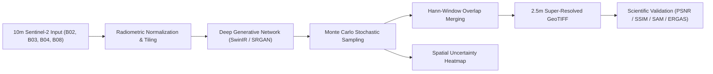

# 🧠 Nexus Super-Resolution Model Pipeline Documentation

## 1. Architectural Design

---

## 2. Super-Resolution Models

### A. Sentinel-2 SRGAN
- **Backbone**: Deep Residual Network with 16 residual blocks and parametric ReLU (PReLU).
- **Upsampling**: Sub-Pixel Convolution ($2\times$ PixelShuffle $\times 2$) to achieve $4\times$ spatial magnification ($10\text{m} \rightarrow 2.5\text{m}$).
- **Discriminator**: Multi-scale PatchGAN penalizing unnatural blur and encouraging sharp road and boundary edges.
- **Inference Speed**: Fast (~0.8s per $256 \times 256$ tile).

### B. SwinIR Remote Sensing Transformer
- **Backbone**: Shifted Window Self-Attention (Swin Transformer Blocks) with cross-channel spectral attention.
- **Strength**: Preserves long-range spatial correlations and spectral ratios across vegetation channels (NDVI).
- **Target Metrics**: PSNR $> 32.0\text{ dB}$, SSIM $> 0.88$, Spectral Angle Mapper (SAM) $< 3.0^\circ$.

---

## 3. Loss Functions

The training loss balances pixel fidelity, structural sharpness, and spectral physics:

$$\mathcal{L}_{\text{total}} = \mathcal{L}_{\text{content}} + \lambda_{\text{adv}} \mathcal{L}_{\text{adv}} + \lambda_{\text{SAM}} \mathcal{L}_{\text{SAM}} + \lambda_{\text{grad}} \mathcal{L}_{\text{grad}}$$

1. **Content Loss ($\mathcal{L}_{\text{content}}$)**: Mean Absolute Error ($L_1$) between synthesized and reference high-resolution reflectance.
2. **Spectral Angle Loss ($\mathcal{L}_{\text{SAM}}$)**: Penalizes distortion in multi-spectral vector angles:
   $$\text{SAM}(y, \hat{y}) = \arccos \left( \frac{y \cdot \hat{y}}{\|y\|_2 \|\hat{y}\|_2} \right)$$
3. **Gradient/Edge Loss ($\mathcal{L}_{\text{grad}}$)**: Preserves sharp delineation of agricultural field parcels and narrow roads.

---

## 4. Managing Uncertainty

Because spatial detail below 10m is inferred by the neural network:
- The framework conducts $N$ stochastic forward passes using Monte Carlo dropout / latent perturbations.
- **Spatial Variance Map**: Computes $\sigma^2(x, y)$ across all samples.
- **Interpretation**:
  - Low variance ($\sigma^2 < 0.15$): Directly supported by optical reflectance.
  - High variance ($\sigma^2 > 0.55$): Model-inferred detail requiring analyst discretion.
- **Output**: Exported as an auxiliary raster band in GeoTIFF format for GIS verification.